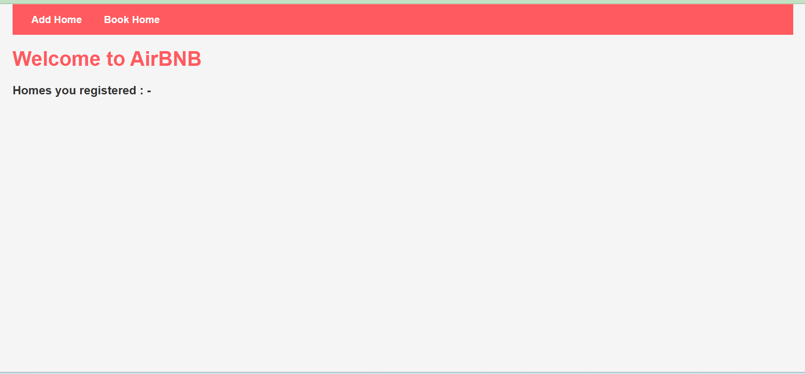
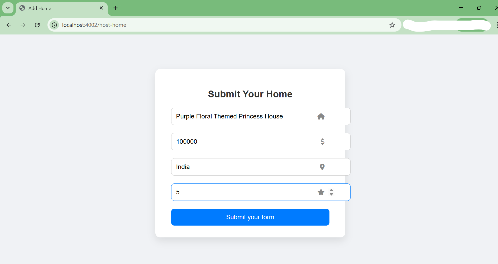
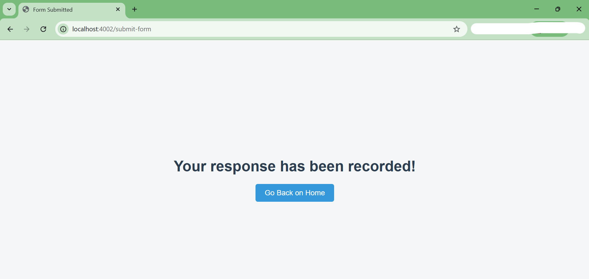
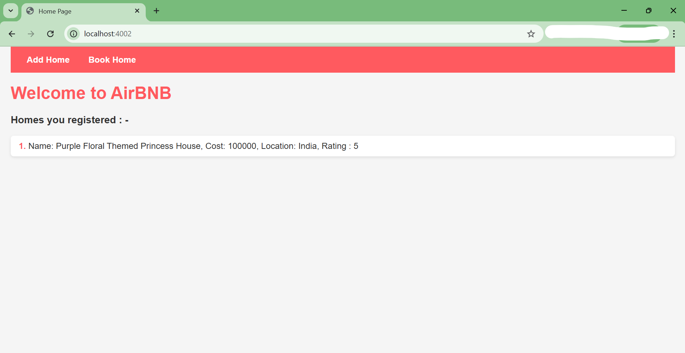
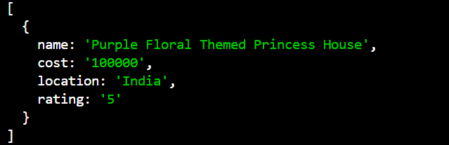

# Air-BNB Server Design

This project is a **basic backend design for an AirBnB-like website**.  
AirBnB is a platform where **people can list their homes for rent**, and **guests can view and book those homes**.

In this project, the main goal is to **simulate the backend logic** that allows hosts to **add homes** and display them on the **home page**.

---

## Project Goal

The purpose of this project is to understand how a **server handles requests, forms, and data flow** in a simple web application.

It demonstrates:

- Creating a **server using Express.js**
- Rendering pages using **EJS templates**
- Handling **form submissions**
- Displaying **dynamic data on the webpage**
- Logging submitted data in the **console**

---

## Tech Stack

The following technologies were used to build this project:

- **Express.js** – Used to create the server and manage routes
- **EJS (Embedded JavaScript)** – Used for dynamic HTML templates
- **HTML & CSS** – Used to design the user interface
- **NPM** – Used to manage project dependencies
- **MVC** - Used as an architectural pattern for organizing and structuring the application efficiently.

---

## How the Application Works

1. A **host opens the website**.
2. The host can **add a home listing** through a form.
3. When the form is submitted:
   - The data is **sent to the Express server**
   - The server **processes the request**
   - The home is **added to the home listings**
4. The new listing **appears on the home page**.
5. The submitted data is also **logged in the server console**.

This flow helps demonstrate how **frontend forms communicate with backend servers**.

---

## Application Screens

### Initial Home Page

This is the main page where available homes are displayed.

---

### Add Home Page (For Hosts)

Hosts can use this page to **add their home listing** by filling out a form.

---

### Form Submission Page

After filling the form, the host submits the details to the server.

---

### Home Successfully Added

Once submitted, the new home appears on the **home page listing**.

---

### Data Logged in Console

The submitted home details are also **printed in the server console** for verification.

