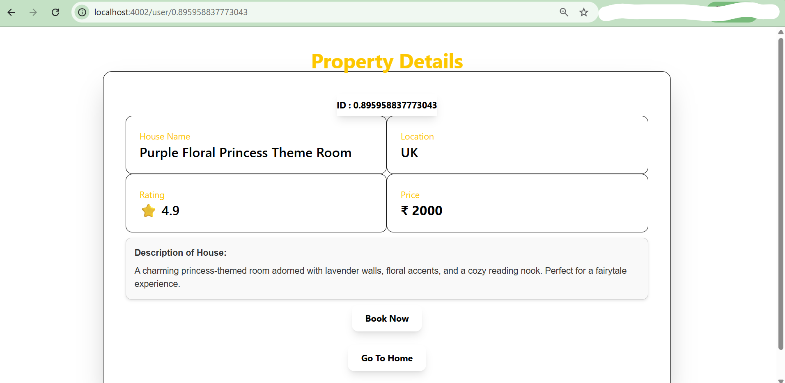

# Air-BNB Server Design

This project is a **basic backend design for an AirBnB-like website**.  
AirBnB is a platform where **people can list their homes for rent**, and **guests can view and book those homes**.

In this project, the main goal is to **simulate the backend logic** that allows hosts to **add homes** and display them on the **home page**.

---

## Project Goal

The purpose of this project is to understand how a **server handles requests, forms, and data flow** in a simple web application.

It demonstrates:

- Creating a **server using Express.js**
- Rendering pages using **EJS templates**
- Handling **form submissions**
- Displaying **dynamic data on the webpage**
- Logging submitted data in the **console**

---

## Tech Stack

The following technologies were used to build this project:

- **Express.js** – Utilized to build the server and handle routing.  
- **EJS (Embedded JavaScript)** – Used for rendering dynamic HTML templates.  
- **HTML & CSS** – Employed to design and structure the user interface.  
- **NPM** – Used for managing project dependencies.  
- **MVC (Model-View-Controller)** – Adopted as the architectural pattern to efficiently organize and structure the application.  
- **Tailwind CSS** – Provides responsive and modern styling for the UI.  
- **MongoDB** – Serves as the database for storing house details.  
- **Mongoose ODM** – Facilitates interaction with MongoDB through an object data modeling layer.  
- **Cookies and Sessions** – Managed using the Express Session package to handle client login sessions on the server.  
- **Express Validator & Bcrypt.js** – Implemented for authentication by validating and sanitizing login/signup fields and securely hashing passwords.  
- **Multer** – Enables and manages user file uploads.  
- **REST APIs** – Allow the frontend and backend to communicate, supporting a decoupled client-server architecture for the project’s final implementation.

---

## How the Application Works

1. A **host opens the website**.
2. The host can **add a home listing** through a form.
3. When the form is submitted:
   - The data is **sent to the Express server**
   - The server **processes the request**
   - The home is **added to the home listings**
4. The new listing **appears on the home page**.
5. The submitted data is also **logged in the server console**.
6. The submitted data persists in the database even after the server is restarted or terminated. As a result, all registered homes from previous server sessions continue to appear on the home page.
7. For viewing detailed description, user can click on **details** button.

This flow helps demonstrate how **frontend forms communicate with backend servers**.

---

## Application Screens

### Initial Home Page for User

This is the entry page for a person logged in as User where available homes will be displayed.

<!-- Old Design  -->
<!-- Old Design [Home Page](image-5.png) -->

---
### Initial Home Page for Host
This is the entry page for a person logged in as Host where their added homes will be displayed.

### Add Home Page (For Hosts)

Hosts can use this page to **add their home listing** by filling out a form.

<!--  Old Design  -->

---

### Form Submission Page

After filling the form, the host submits the details to the server.

<!--  Old Design  -->
<!-- Old Design [Form Submission](image-7.png) -->

---

### Home Successfully Added

Once submitted, the new home appears on the **home page listing**.

<!-- Old Design   -->

---

### Data Logged in Console
The detailed description is hidden from the home page for brevity, but is displayed on each individual home's details page.

<!--Old Design  -->

### Data Logged in Console

The submitted home details are also **printed in the server console** for verification.

